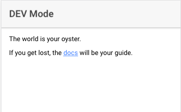

# Ionic 3.9.2 Environment Settings Starter

### Need to add below files


#### config/webpack.config.js
```javascript

var path = require('path');
var defaultConfig = require('@ionic/app-scripts/config/webpack.config.js');

const DEV_ENV  = './src/env/env.ts';
const PROD_ENV = './src/env/env.prod.ts';

const devAlias = {
  "@app/env" : path.resolve(DEV_ENV)
};
const prodAlias = {
  "@app/env" : path.resolve(PROD_ENV)
};

module.exports = function () {
  defaultConfig.dev.resolve.alias  = devAlias;
  defaultConfig.prod.resolve.alias = prodAlias;

  return defaultConfig;
};

```

#### src/env/env.interface.ts
```javascript
export interface Environment {
  mode: string;
}
```

#### src/env/env.ts
```javascript
import {Environment} from "./env.interface";

export const ENV: Environment = {
  mode: "DEV"
}
```

#### src/env/env.prod.ts
```javascript
import {Environment} from "./env.interface";

export const ENV: Environment = {
  mode: "Production"
}
```

#### package.json (add below "config")
```javascript
{
  ...
  "config": {
    "ionic_webpack": "./config/webpack.config.js"
  },
  ...
}
```

#### tsconfig.json (add below "baseUrl, paths" in the compilerOptions object)
```javascript
{
  "compilerOptions": {
    ...
    "baseUrl" : "./src",
    "paths" : {
      "@app/env" : [
        "env/env"
      ]
    }
  },
  ...
}
```

<hr>

### Things you need to know before build

- ***ionic serve*** doesn't support ***--prod***. (It means though you add ***--prod***, it just uses --dev mode)
- You can use below commands for ***--prod*** mode.
```
$ ionic cordova build ios --prod
$ ionic cordova build android --prod
$ ionic cordova build browser --prod
```




<hr>

### notice
***From IONIC 4, ENV variables will be handled. It means you don't need to modify or add things with webpack***
